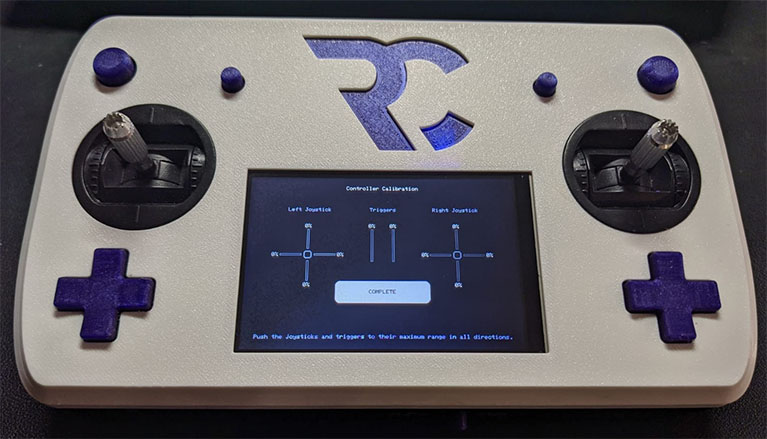
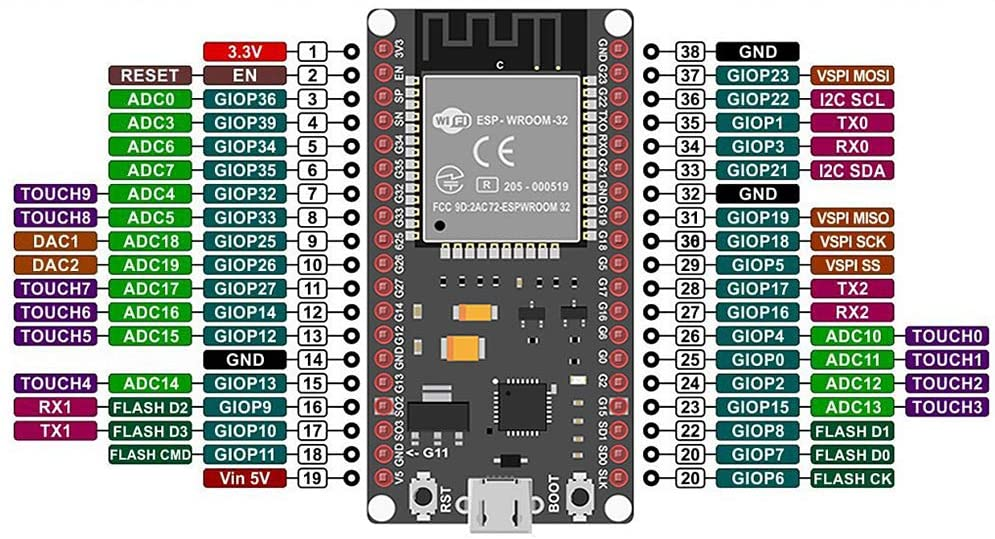

# RC Remote 
Controller with screen 3.5" resistive touch screen.

Pin Addressing
==============

GPIO pins and their associated device.
GPA & GPB pins are on the registers A & B on the MCP23017.

Device   | Pin Name | Pin ID | Type  |
---------|----------|--------|-------|
STMPE    | GPIO12   | 12     | CS    |
STMPE    | GPIO14   | 14     | IRQ   |
TFT      | GPIO2    | 2      | ADC12 |
TFT      | GPIO5    | 5      | CS    |
TFT      | GPIO13   | 13     | DC    | 
TFT      | GPIO18   | 18     | SCK   |
TFT      | GPIO19   | 19     | MISO  |
TFT      | GPIO23   | 23     | MOSI  |
MCP23017 | GPIO0    | 0      | IRQ   |
RF24     | GPIO1    | 1      | IRQ   |
RF24     | GPIO25   | 25     | CE    |
RF24     | GPIO26   | 26     | CS    |
VOLTAGE  | GPIO4    | 4      | ADC10 |
L-JOY-X  | GPIO32   | 32     | ADC4  |
L-JOY-Y  | GPIO33   | 33     | ADC5  |
R-JOY-X  | GPIO34   | 34     | ADC6  |
R-JOY-Y  | GPIO35   | 35     | ADC7  |
L-TRIG   | GPIO36   | 36     | ADC0  |
R-TRIG   | GPIO39   | 39     | ADC3  |
L-AUX    | GPIO16   | 16     | IRQ   |
R-AUX    | GPIO17   | 17     | IRQ   |
L-BUMPER | GPA0     | 0      | IRQ   |
L-DPAD-U | GPA1     | 1      | IRQ   |
L-DPAD-D | GPA2     | 2      | IRQ   |
L-DPAD-R | GPA3     | 3      | IRQ   |
L-DPAD-L | GPA4     | 4      | IRQ   |
R-BUMPER | GPB0     | 8      | IRQ   |
R-DPAD-U | GPB1     | 9      | IRQ   |
R-DPAD-D | GPB2     | 10     | IRQ   |
R-DPAD-R | GPB3     | 11     | IRQ   |
R-DPAD-L | GPB4     | 12     | IRQ   |
